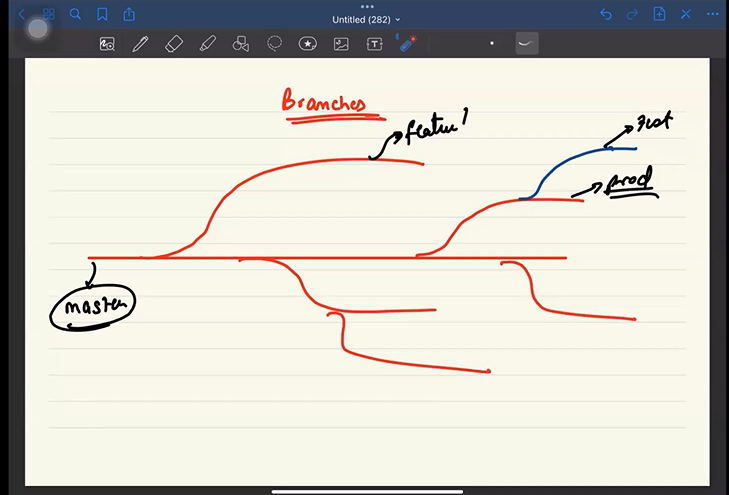
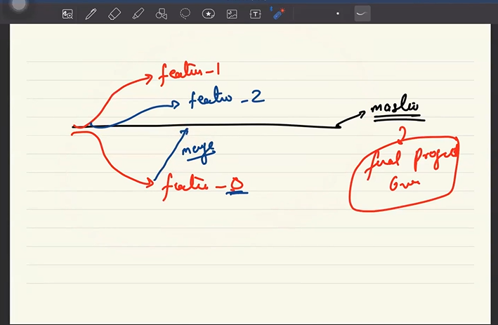

<!-- !-----------------Branches in Git------------- -->
<!--^ by default the branch is set to master in git -->

## let's say we want to work on multiple features how we work

<!-- * how to create branch -->
<!--^ command for creating new branch--> git  checkout -b <fileName> --> let's say we have created a brach named feature_1 by the command
<!--^ git checkout -b feature_1   and  then we worked there for time and we want to change the branch then do:  "git checkout master" to change the branch to feature_1 to master -->

git remote add origin https://github.com/sofikulsk02/TypeScript.git

## return key is basically enter key

## to come out from the git log terminal press 'q'

<!--! ###never do a forcefull push you will be fired from the company for sure -->

## git pull origin master

<!-- ^----------------------------------------------- -->

## if we have two team members in a team always do

1.git add
2.git commit
3.git pull
4.git push
