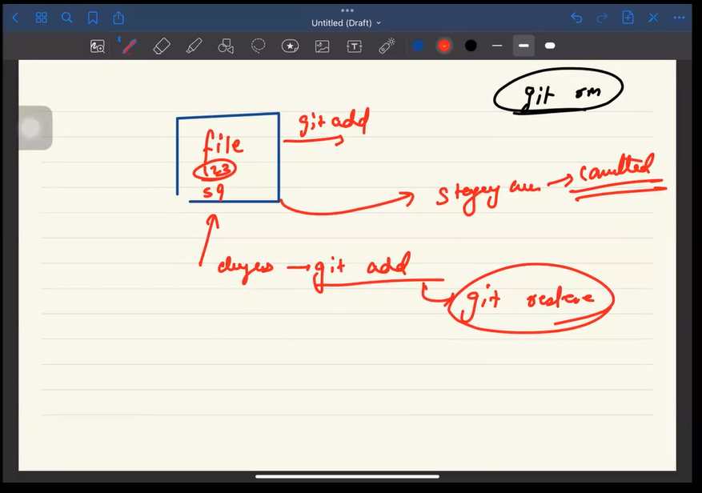

<!-- * -->
<!-- ! git remote add origin https://github.com/singhsanket/xyz.git -->

<!-- ! git push origin master -->

git init
git branch -b main
git remote add origin path
git add .
git commit -m 'msg'
git push origin main

<!--^6 internally git is a <key value> pair to store the data -->
<!-- key: hash of the data we wnat to store and value: actual data -->
<!-- key is 40 digit hexadecimal value for same data the hash will be same
 git store the compressed data in a blob(big large object) and some meta data in header-->
 <!-- ! the key value is actually stored inside 'object' directory in side this directory we the key and with the first 2 didgits of the key we take and make a folder and with the remainin 38 we create file -->
 <!-- * as we know that the key is 40 digit hash value ;among the 40 digits it use only 2 digit to name the directory and another file for the 38 digits -->
  <!-- ^ to remove a FOLDER ,let's say we have the a folder called hooks inside the '.git'
<!--^  we have run command : --> rm rf .git/hooks  -->

<!-- ! suppose we have created two file text1.js and text2.js and inside the two file we have same content ,and if we add these file we will observe that only one key will be created this is because for the same value only one hash is possible
<!-- * even if we delete the two file the object would steel be present on that directory --> -->
<!-- ~ the object is stored in compressed form,it mainly store the change and algorythemivcally shows up the file created with that change -->
<!-- ^ the conclusion is that inside git content is only stored once -->

<!--* ### Tree : stores information about directories and their content-->

<!-- ?--------------------- Commit ------------------ -->
<!-- ? commit is also an object which also points to a tree  -->
<!-- ? the commit object has data of the commit ,parent commit,commit message-->
<!-- ? -->

<!-- ! Change the commit -->

git commit --amend : this command will open a terminal
where you can make your change

<!-- *When we code,it can lies in one of the following 3 area -->
<!-- ^ -----------------Working area-------------------->
<!-- ^ the files which are not in your stagging area and maybe not handle by git are in working area these files area also called as working area -->

<!-- ^ ------------------stagging area------------- -->
<!-- ^ files and changes which are surely going to be part of the  next commit are in stagging area -->
<!-- ^ (i.e on file/changes when we do git add) stagging area is the palce what will change b/w the current and the next area-->
<!-- ^ to unstagged a file which is alreay staged : git rm --cached <file.name> -->
<!-- ^ if we commit some changes and after some time we came back and agian started on that file and we did some mistake and commit that mistake,then in that case we restore the latest commits by the command
^ git restore --staged <file> -->

<!-- ^ ---------------------repo area------------- -->
<!-- ^ when we do commit the whole change goes to repo area(all our commits exist) git add -p :it will ask you if you're interested adding the changes-->
